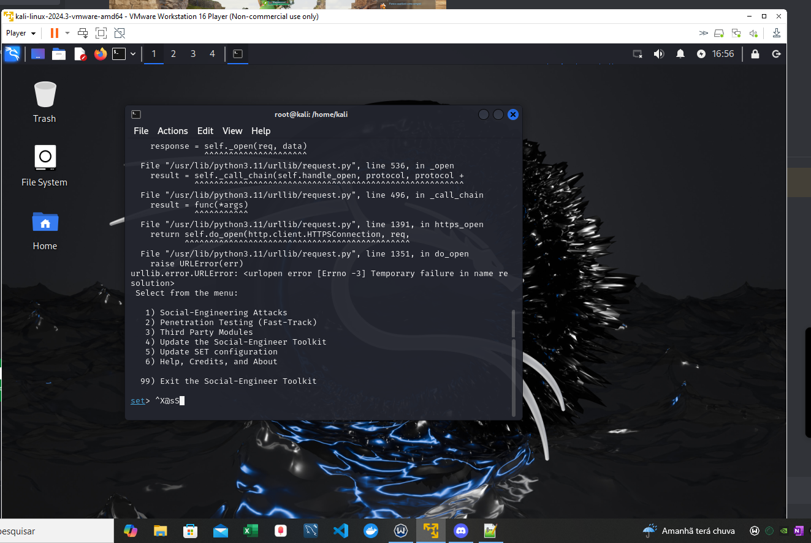
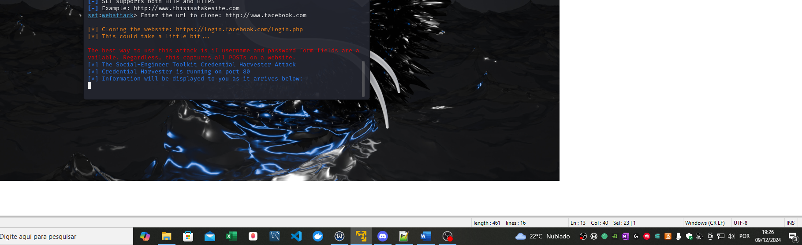
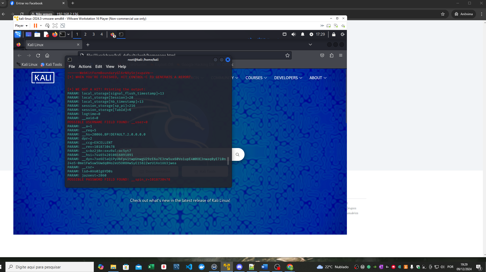

# Phishing to capture Facebook passwords

### Features
- Kali Linux
- setoolkit

### Setting Up Phishing on Kali Linux


- Get the IP address: ```ifconfig```

-Use access root: ```Sudo su```

- Set up the setoolkit feature: ```setoolkit```

- Choose the attack type: ```1- Social-Engineering Attacks```

- Choose the attack vector:``` 2-Web Site Attack Vectors```

-Choose the attack method: ```3-Credential Harvester Attack Method```

-Site to be cloned: ```Site Cloner```

-URL a ser clonada: http://www.facebook.com




-Resultado:

